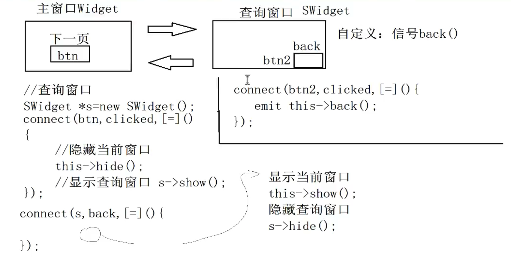

# qt-signal-slot-demo
qt signals and slot demo project  ,  just for demo

信号定义

~~~h
signals: //定义信号的规则:  返回值类型为void  只需什么  不用实现  可以有参数 可以重载
    void hungry();
    void hungry(QString str);
~~~

插槽定义

~~~.h
public slots:// 自定义槽函数
    // 返回值类型为 void   需要声明  需要实现  可以有参数  可以重载
    void treat();
    void treat(QString str);
~~~

建立信号连接 ( 信号和槽函数需要使用函数引用或者函数指针 )

~~~cpp
// 标准模式
connect(信号发起者, 信号, 接受者, 槽函数);

// 项目中常用 lambda模式
// lambda表达式  [=] 这里的 = 表示该函数可以识别函数所在范围的控件,如果不加等号,则lambda表达式内部不能访问外部的对象.
connect(信号发起者, 信号, [=](){
        qDebug() << "信号" << endl;
    });

~~~

qt4的定义方式

~~~cpp
connect(信号发起者,SIGNAL(信号()),信号接收者, SLOT(槽()));
~~~

当信号或者槽函数有重载的时候, 指定槽函数或者信号 需要使用**函数指针** 指明具体的信号或者函数, 如

~~~cpp
void (Teacher::*p1)(QString str) = &Teacher::hungry;
void (Student::*p2)(QString str) = &Student::treat;
connect(teacher,p1, student, p2);

~~~

emit 信号触发

~~~cpp
  emit teacher->hungry("烧烤");
~~~

窗口切换

在主窗口中需要监听返回页面的信号, 然后显示主窗口,隐藏查询窗口

